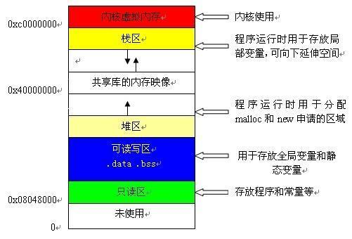
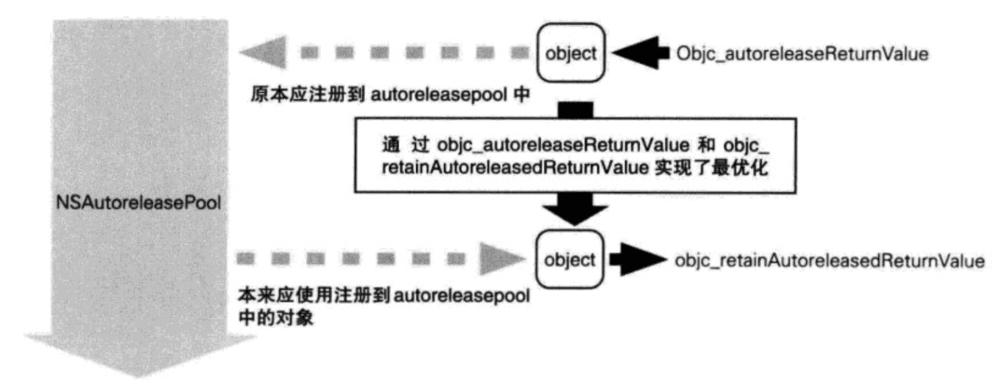
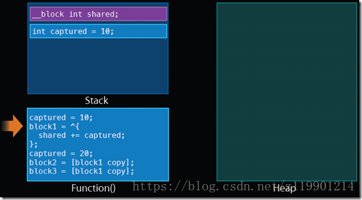
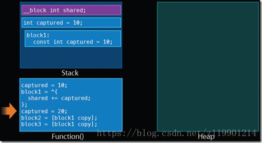
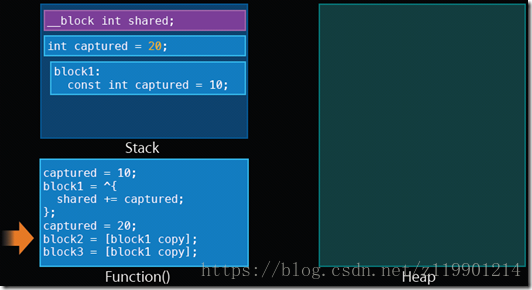
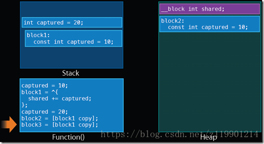
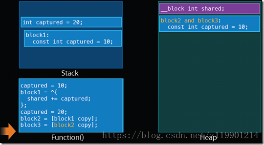
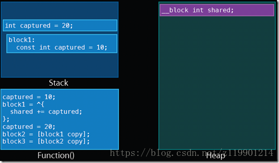
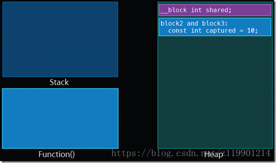
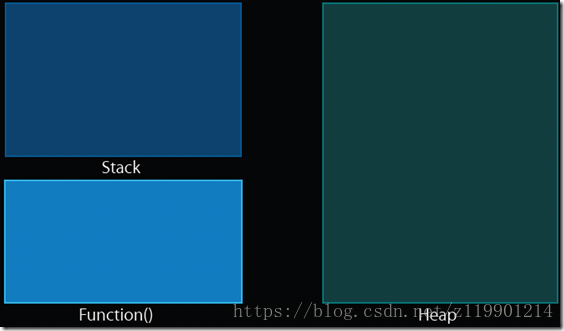

## 堆与栈
1.栈区(stack):由编译器自动分配释放，函数的参数值，局部变量等值。  
2.堆区(heap):一般由开发人员分配释放，若不释放，则可能会引起内存泄漏。

```
NSString* string = @"sdfsdf";//常量string->栈
NSMutableString* mString = [[NSMutableString alloc] initWithString:@"sdfsdf"];//mString->堆
```

## 引用计数器
ObjC采用引用计数（reference counting）技术来进行内存管理：
1. 每个对象都有一个关联的整数，称为引用计数器
2. 当代码需要使用该对象时，则将对象的引用计数加1
3. 当代码结束使用该对象时，则将对象的引用计数减1
4. 当引用计数的值变为0时，此时对象将被释放。

与之对应的消息发送方法如下：
1. 当对象被创建（alloc、new或copy等方法）时，其引用计数初始值为1
2. 给对象发送retain消息，其引用计数加1
3. 给对象发送release消息，其引用计数减1
4. 当对象引用计数归0时，ObjC給对象发送dealloc消息销毁对象

例如：
```
RetainCountObject * object = [[RetainCountObject alloc]init];  // -->引用计数为1
[object retain];      // -->引用计数为2
[object release];     // -->引用计数为1
[object release];     // -->引用计数为0
object = nil;         // -->销毁对象

特殊情况
NSString * str = @" hello";  // -->引用计数为-1，常量对象由栈管理，没有引用计数
```
## 自动释放池
### 原理
自动释放池，系统有一个现成的自动内存管理池，他会随着每一个mainRunloop的结束而释放其中的对像.自动释放池也可以手动创建，他可以让池中的对象在执行完代码后马上被释放，可以起到优化内存，防止内存溢出的效果（如视频帧图片的切换时、创建大量临时对象时等）。    

autorelease  
延迟释放，注册到autoreleasepool(自动释放池)中，等到pool结束时释放池再自动调用release进行释放.每个Runloop中都创建一个Autorelease pool（自动释放池），每一次的Autorelease，系统都会把该Object放入了当前的Autorelease pool中，并在Runloop的末尾进行释放，而当该pool被释放时，该pool中的所有Object会被调用Release。 所以，一般情况下，每个接受autorelease消息的对象，都会在下个Runloop开始前被释放  

release  
立即释放

autorelease的具体使用方法如下
* 生成并持有NSAutoreleasePool对象。
* 调用已分配对象的autorelease实例方法。
* 废弃NSAutoreleasePool对象。

### 创建
```
MRC：
NSAutoreleasePool* pool = [[NSAutoreleasePool alloc]init];
// do something
id obj = [[NSMutableArray alloc] init];
[obj autorelease];
[pool release];
// [pool drain];//GC（垃圾回收机制）环境没影响

ARC：
@autoReleasePool{
   id __autoreleasing obj2;
   obj2 = obj;
}
```
调用过autorelease实例方法的对象（MRC，同ARC使用__autoreleasing修饰符的对象）被加入到了autoreleasepool,在pool release时，这些被加入的对象将调用release进行释放.autorelease实例方法的本质就是调用NSAutoreleasePool对象的addObject类方法。
```
- (id) autorelease {
    [NSAutoreleasePool addObject: self];
}
```

### 触发
```
- (void)autoRelease_Test {
    @autoreleasepool {
        TestModel *model = [[TestModel alloc] init];
        [model autorelease];
        //model can dongSomething you want
        NSLog(@"自动释放：end");
    }
}
```
MRC_Project[2678:287011] 自动释放：end  
MRC_Project[2678:287011] TestModel dealloc  
可以看到，当自动释放调用后，model对象才被释放，因此在池子释放之前，model可以正常调用。


## MRC

### 自己生成的对象，自己持有  
当new、alloc、copy、mutableCopy创建一个对象时只有自己持有，引用计数为1  
### 非自己生成的对象，自己也能持有
```
//非自己生成的对象，暂时没有持有
id obj = [NSMutableArray array];
//通过retain持有对象
[obj retain];
```
上述代码中NSMutableArray通过类方法array生成了一个对象赋给变量obj，但变量obj自己并不持有该对象。使用retain方法可以持有对象。
### 不再需要自己持有的对象时释放
自己持有的对象，一旦不再需要，持有者有义务释放该对象。释放使用release方法
* 自己生成并持有对象的释放
```
// 自己生成并持有对象
id obj = [[NSObject alloc] init];
//释放对象
[obj release];
```
* 非自己生成的对象持有对象的释放
```
//非自己生成的对象，暂时没有持有
id obj = [NSMutableArray array];

//通过retain持有对象
[obj retain];

//释放对象
[obj release];
```
* 非自己生成的对象本身的释放
```
+ (id)array {
    //生成并持有对象
    id obj = [[NSMutableArray alloc] init];

    //使用autorelease不持有对象
    [obj autorelease];

    //返回对象
    return obj;
}
```
### 非自己持有的对象无法释放
对于用alloc/new/copy/mutableCopy方法生成并持有的对象，或是用retain方法持有的对象，由于持有者是自己，所以在不需要该对象时需要将其释放。而由此以外所得到的对象绝对不能释放。倘若在程序中释放了非自己所持有的对象就会造成崩溃。


## ARC
一个编译器级的能简化应用中对象内存管理流程的功能。它并非运行时的特性，也不是如java中的GC运行时的垃圾回收系统。在编译阶段，编译器将在项目代码中自动为分配对象插入retain、release、copy、autorelease和autoreleasepool，且插入的代码不可见。ARC模式下引用计数规则还起作用，只是编译器会为开发者分担大部分的内存管理工作，除了插入上述代码，还有一部分优化以及分析内存的管理工作。
例如
```
-(void)setup
{
    per = [person new];
}
```
在手工管理内存的环境下，per是不会自动保留其值，而在ARC下编译，其代码会变成：
```
-(void)setup
{
    person *tmp = [person new];
    per = [tmp retain];
    [tmp release];
}
```
ARC系统在自动调用这些方法时，并不通过普通的Objective-C消息派发控制，而是直接调用底层C语言的方法：比如retain，ARC在分析到某处需要调用保留操作的地方，调用了与retain等价的底层函数 objc_retain，所以这也是ARC下不能覆写retain、release或者autorelease的原因，因为这些方法在ARC从来不会被直接调用

### 修饰符

#### __strong
强引用，对应定义 property 时用到的 strong。当对象没有任何一个强引用指向它时，它才会被释放。如果在声明引用时不加修饰符，那么引用将默认是强引用。当需要释放强引用指向的对象时，需要保证所有指向对象强引用置为 nil。__strong 修饰符是 id 类型和对象类型默认的所有权修饰符。  
```
{
    id __strong obj = [[NSObject alloc] init];
}

//编译器的模拟代码
id obj = objc_msgSend(NSObject,@selector(alloc));
objc_msgSend(obj,@selector(init));

// 出作用域的时候调用
objc_release(obj);
```
虽然ARC有效时不能使用release方法，但由此可知编译器自动插入了release。  
对象是通过除alloc、new、copy、multyCopy外方法产生的情况
```
{
    id __strong obj = [NSMutableArray array];
}
```
结果与之前稍有不同：
```
//编译器的模拟代码
id obj = objc_msgSend(NSMutableArray,@selector(array));
objc_retainAutoreleasedReturnValue(obj);
objc_release(obj);
```
objc_retainAutoreleasedReturnValue函数主要用于优化程序的运行。它是用于持有(retain)对象的函数，它持有的对象应为返回注册在autoreleasePool中对象的方法，或是函数的返回值。像该源码这样，在调用array类方法之后，由编译器插入该函数。

而这种objc_retainAutoreleasedReturnValue函数是成对存在的，与之对应的函数是objc_autoreleaseReturnValue。它用于array类方法返回对象的实现上。下面看看NSMutableArray类的array方法通过编译器进行了怎样的转换：
```
+ (id)array
{
    return [[NSMutableArray alloc] init];
}

//编译器模拟代码
+ (id)array
{
    id obj = objc_msgSend(NSMutableArray,@selector(alloc));
    objc_msgSend(obj,@selector(init));

    // 代替我们调用了autorelease方法
    return objc_autoreleaseReturnValue(obj);
}
```
我们可以看见调用了objc_autoreleaseReturnValue函数且这个函数会返回注册到自动释放池的对象，但是，这个函数有个特点，它会查看调用方的命令执行列表，如果发现接下来会调用objc_retainAutoreleasedReturnValue则不会将返回的对象注册到autoreleasePool中而仅仅返回一个对象。达到了一种最优效果。如下图：


#### __weak
弱引用，对应定义 property 时用到的 weak。弱引用不会影响对象的释放，而当对象被释放时，所有指向它的弱引用都会自定被置为 nil，这样可以防止野指针。使用__weak修饰的变量，即是使用注册到autoreleasePool中的对象。__weak 最常见的一个作用就是用来避免循环循环。
__weak 的几个使用场景：  
* 在 Delegate 关系中防止循环引用。
* 在 Block 中防止循环引用。
* 用来修饰指向由 Interface Builder 创建的控件。比如：@property (weak, nonatomic) IBOutlet UIButton *testButton;。
```
{
    id __weak obj = [[NSObject alloc] init];
}

编译器转换后的代码如下:
id obj;
id tmp = objc_msgSend(NSObject,@selector(alloc));
objc_msgSend(tmp,@selector(init));
objc_initweak(&obj,tmp);
objc_release(tmp);
objc_destroyWeak(&object);
```
对于__weak内存管理也借助了类似于引用计数表的散列表，它通过对象的内存地址做为key，而对应的__weak修饰符变量的地址作为value注册到weak表中，在上述代码中objc_initweak就是完成这部分操作，而objc_destroyWeak则是销毁该对象对应的value。当指向的对象被销毁时，会通过其内存地址，去weak表中查找对应的__weak修饰符变量，将其从weak表中删除。所以，weak在修饰只是让weak表增加了记录没有引起引用计数表的变化.  
对象通过objc_release释放对象内存的动作如下:  
> objc_release  
> 因为引用计数为0所以执行dealloc  
> _objc_rootDealloc  
> objc_dispose  
> objc_destructInstance  
> objc_clear_deallocating  

而在对象被废弃时最后调用了objc_clear_deallocating，该函数的动作如下:  

> 从weak表中获取已废弃对象内存地址对应的所有记录  
> 将已废弃对象内存地址对应的记录中所有以weak修饰的变量都置为nil  
> 从weak表删除已废弃对象内存地址对应的记录  
> 根据已废弃对象内存地址从引用计数表中找到对应记录删除  
据此可以解释为什么对象被销毁时对应的weak指针变量全部都置为nil，同时，也看出来销毁weak步骤较多，如果大量使用weak的话会增加CPU的负荷。  
还需要确认一点是：使用__weak修饰符的变量，即是使用注册到autoreleasePool中的对象。  
```
{
    id __weak obj1 = obj;
    NSLog(@"obj2-%@",obj1);
}
编译器转换上述代码如下:
id obj1;
objc_initweak(&obj1,obj);
id tmp = objc_loadWeakRetained(&obj1);
objc_autorelease(tmp);
NSLog(@"%@",tmp);
objc_destroyWeak(&obj1);
```
objc_loadWeakRetained函数获取附有__weak修饰符变量所引用的对象并retain, objc_autorelease函数将对象放入autoreleasePool中，据此当我们访问weak修饰指针指向的对象时，实际上是访问注册到自动释放池的对象。因此，如果大量使用weak的话，在我们去访问weak修饰的对象时，会有大量对象注册到自动释放池,这会影响程序的性能。

解决方案：要访问weak修饰的变量时，先将其赋给一个strong变量，然后进行访问

为什么访问weak修饰的对象就会访问注册到自动释放池的对象呢?

因为weak不会引起对象的引用计数器变化，因此，该对象在运行过程中很有可能会被释放。所以，需要将对象注册到自动释放池中并在autoreleasePool销毁时释放对象占用的内存。

#### __unsafe_unretained
ARC 是在 iOS5 引入的，而 __unsafe_unretained 这个修饰符主要是为了在ARC刚发布时兼容iOS4以及版本更低的系统，因为这些版本没有弱引用机制。这个修饰符在定义property时对应的是unsafe_unretained。__unsafe_unretained 修饰的指针纯粹只是指向对象，没有任何额外的操作，不会去持有对象使得对象的 retainCount +1。而在指向的对象被释放时依然原原本本地指向原来的对象地址，不会被自动置为 nil，所以成为了野指针，非常不安全。

__unsafe_unretained 的应用场景：

在 ARC 环境下但是要兼容 iOS4.x 的版本，用__unsafe_unretained 替代 __weak 解决强循环循环的问题。

#### __autoreleasing
将对象赋值给附有__autoreleasing修饰符的变量等同于MRC时调用对象的autorelease方法。  
```
@autoeleasepool {
    // 如果看了上面__strong的原理，就知道实际上对象已经注册到自动释放池里面了
    id __autoreleasing obj = [[NSObject alloc] init];
}

编译器转换上述代码如下:
id pool = objc_autoreleasePoolPush();
id obj = objc_msgSend(NSObject,@selector(alloc));
objc_msgSend(obj,@selector(init));
objc_autorelease(obj);
objc_autoreleasePoolPop(pool);
```
```
@autoreleasepool {
        id __autoreleasing obj = [NSMutableArray array];
    }

编译器转换上述代码如下:
id pool = objc_autoreleasePoolPush();
id obj = objc_msgSend(NSMutableArray,@selector(array));
objc_retainAutoreleasedReturnValue(obj);
objc_autorelease(obj);
objc_autoreleasePoolPop(pool);

```
上面两种方式，虽然第二种持有对象的方法从alloc方法变为了objc_retainAutoreleasedReturnValue函数，都是通过objc_autorelease，注册到autoreleasePool中。


### arc及mrc的属性
```
//简单的赋值  
@property (nonatomic, assign) int value;     
//引用计数器加一，指针复制  
@property (nonatomic, retain) NSArray* array;   
//生成新的内存区域，内容复制  
@property (nonatomic, copy) NSString* string;   
//强引用，当所有指向同一块内存的强指针都赋空时，内存将被释放  
@property (nonatomic, strong) NSNumber* number;   
//弱引用， 当所有指向同一块内存的强指针都赋空时，弱引用失效,为nil  
@property (nonatomic, weak) NSData* data;    
//不安全性弱引用，当所有指向同一块内存的强指针都赋空时，该对象将成为野指针，再次调用会导致程序崩溃  
@property (nonatomic, unsafe_unretained) NSData* data1;    

- (NSString *)string{   
    return _string;   
}

- (void)setString:(NSString*)string{   
    _string = string;   
    //weak,strong,assign 的set方法   
}

- (void)setString:(NSString*)string{   
    if(_string != string) {   
        [_string release];   
        _string = [string retain];   
    }   
    //retain 的set方法   
}

- (void)setString:(NSString*)string{   
    if(_string != string) {   
        [_string release];   
        _string = [string copy];   
    }   
    //copy 的set方法   
}

//释放属性对象   
- (void)dealloc {   
    self.string = nil;   
    [super dealloc];   
}
```
### ARC规则
不能使用retain/release/retainCount/autorelease  
不能使用NSAllocateObject/NSDeallocateObject  
须遵守内存管理的方法命名规则  
>alloc,new,copy,mutableCopy,init
以init开始的方法的规则要比alloc,new,copy,mutableCopy更严格。该方法必须是实例方法，并且要返回对象。返回的对象应为id类型或方法声明类的对象类型，抑或是该类的超类型或子类型。该返回对象并不注册到autoreleasepool上。基本上只是对alloc方法返回值的对象进行初始化处理并返回该对象。  

不要显式调用dealloc  

### mrc到arc的转变
引用方式：  
copy：拷贝，复制一个对象并创建strong关联，引用计数为1 ，原来对象计数不变。  
assign：赋值，不涉及引用计数的变化，弱引用。ARC中对象不使用assign,但原始类型(BOOL、int、float)仍然可以使用。  
retain：持有，对原对象引用计数加1，强引用。ARC中使用strong。  
weak：赋值（ARC），比assign多了一个功能，对象释放后把指针置为nil，避免了野指针。  
strong：持有（ARC），等同于retain。  

在你打开ARC时，你是不能使用retain、release、autorelease 操作的，原先需要手动添加的用来处理内存管理的引用计数的代码可以自动地由编译器完成了，但是你需要在对象属性上使用weak 和strong, 其中strong就相当于retain属性，而weak相当于assign，基础类型只需声明非原子锁即可。

## 内存泄露  
#### 僵尸对象和野指针
僵尸对象：内存已经被回收的对象。  
野指针：指向僵尸对象的指针，向野指针发送消息会导致崩溃。  
### 循环引用
arc中默认的对象声明都是strong性质的，在两个或两个以上的类相互引用时，会导致循环引用，其中一方需要用weak修饰，才不会造成retainCycle，如：delegate 属性用weak声明；mrc中即用assign修饰 。  
* 在block中引用block所属的类、实例变量或类的属性也会导致循环引用
```
self.block = ^{   
        [self doSomething];   
 };
```
block是会对内部的对象进行一次retain。也就是说，self会被retain一次。当self释放的时候，需要block释放后才会对self进行释放，但是block的释放又需要等self的dealloc中才会释放。如此一来变形成了循环引用，导致内存泄露。  
arc中用__weak修饰self、mrc中用__block修饰,如下代码:
```
__weak ViewController* weakSelf = self;//arc   
//__block ViewController* weakSelf = self;//mrc   
self.block = ^{   
   [weakSelf doSomething];   
};
```
* NSTimer的target持有self
> NSTimer会造成循环引用，timer会强引用target即self，一般self又会持有timer作为属性，这样就造成了循环引用。
那么，如果timer只作为局部变量，不把timer作为属性呢？同样释放不了，因为在加入runloop的操作中，timer被强引用。而timer作为局部变量，是无法执行invalidate的，所以在timer被invalidate之前，self也就不会被释放。

#### 循环中对象占用内存大
这个问题常见于循环次数较大，循环体生成的对象占用内存较大的情景。
```
for (int i = 0; i < 10000; i ++) {  
  Person * soldier = [[Person alloc]init];   
  [soldier fight];    
}
```
该循环内产生大量的临时对象，直至循环结束才释放，可能导致内存泄漏，解决方法和上文中提到的自动释放池常见问题类似：在循环中创建自己的autoReleasePool，及时释放占用内存大的临时变量，减少内存占用峰值。
```
for (int i = 0; i < 10000; i ++) {  
  @autoreleasepool {  
    Person* soldier = [[Person alloc]init];  
    [soldier fight];  
  }  
}
```
然而有时候autoReleasePool也不是万能的：  
```
for (int i = 0; i < 2000; i ++) {  
  CGSize size = [UIImage imageNamed:[NSString stringWithFormat:@"%d.jpg",i]].size;         
}
```
用imageNamed方法加载图片占用Cache的内存，autoReleasePool也不能释放。  
```
for (int i = 0; i < 2000; i ++) {
  @autoreleasepool {
    CGSize size = [UIImage imageWithContentsOfFile:filePath].size;             
   }
}
```
#### 系统内存警告
```
- (void)didReceiveMemoryWarning {
    [super didReceiveMemoryWarning];
    self.view = nil;
    self.data = nil;
}
```

#### 对象型变量作为C语言结构体（struct、union）的成员
```
struct Data {
    NSMutableArray __unsafe_unretained *array;
};
```
OC对象型变量如果成为了C语言结构体的成员，那么，ARC不能掌握该对象的生命周期从而有效管理内存，因此，不能这样使用。

#### 显式转换"id" 和 "void*"
```
非ARC下:  
id obj = [[NSObject alloc] init];
void *p = obj;
这样的代码是可行的，id和void*可以方便得自由转化 ，但是，在ARC下是不一样的

ARC下id和void*有三个转换的关键字 __bridge、__bridge_retained、__bridge_transfer:
id obj = [[NSObject alloc] init];
void *p = (__bridge void*)obj;

注意： __bridge不会引起对象的引用计数变化，因此，安全性不太好。相比较，__bridge_retained不仅仅实现了__bridge的功能而且能让p调用retain方法使p持有对象。另外，
__bridge_transfer也是和release方法类似，使用__bridge_transfer进行转化，既让对象p调用一次retain方法，而且原来指针obj会调用一次release方法也非常安全
```
## Core Foundation 对象
底层的 Core Foundation 对象，在创建时大多以 XxxCreateWithXxx 这样的方式创建，例如：  
```
// 创建一个 CFStringRef 对象
CFStringRef str= CFStringCreateWithCString(kCFAllocatorDefault, “hello world", kCFStringEncodingUTF8);

// 创建一个 CTFontRef 对象
CTFontRef fontRef = CTFontCreateWithName((CFStringRef)@"ArialMT", fontSize, NULL);
```
对于这些对象的引用计数的修改，要相应的使用 CFRetain 和 CFRelease 方法。如下所示：  
```
// 创建一个 CTFontRef 对象
CTFontRef fontRef = CTFontCreateWithName((CFStringRef)@"ArialMT", fontSize, NULL);

// 引用计数加 1
CFRetain(fontRef);

// 引用计数减 1
CFRelease(fontRef);
```
对于 CFRetain 和 CFRelease 两个方法，读者可以直观地认为，这与 Objective-C 对象的 retain 和 release 方法等价。所以对于底层 Core Foundation 对象，我们只需要延续以前手工管理引用计数的办法即可


## Block内存管理
block本身是像对象一样可以retain，和release。但是，block在创建的时候，它的内存是分配在栈(stack)上，而不是在堆(heap)上。  
@property(copy, nonatomic) void(^block)(void);  
mrc中 copy会把block从栈上移动到堆上。  
@property(strong, nonatomic) void(^block)(void);  
arc即时由强引用strong将其从栈复制到堆  
### block 的内存管理：  
  
当程序运行到这里时，stack 空间中有 shared 变量和 captured 变量。这里可以看出，__block 变量开始是处于stack上的。  
  
当程序运行到这里时，stack 空间中有 shared 变量，captured 变量和block1。这里可以看出，block 类型的变量开始时也是处在stack上的。  
  
当程序运行到这里时，stack 空间中有 shared 变量，captured 变量和block1。  
这里值得注意的就是当我们直接修改stack 上的captured变量时，block1中的captured变量仍然是原来的数值10。事实上，从const 我们就可以看出，block1中的captured变量是不能被修改的而且是从stack原有变量的一个const 拷贝。在block1中访问的captured变量是const拷贝的，也就是说block1中captured = 10，而不是原有的stack上的值 20。当然，在block1中，我们也不能修改captured变量。  
### Copy block  
block在一开始是处在stack上的，这是为了考虑到效率的原因，但是，有时候是需要block的生命周期长于一开始的stack，这时，我们就通过copy block 来将block复制到heap。  
  
当程序执行完 block2 = [block1 copy];时，__block 类型变量shared，被复制到了heap中，很显然，shared变量需要被block和block2共享(当然还有stack也要共享)，而block2被移动到heap中，很可能生命周期会长于stack，所以，shared也被复制到了heap中。而block2中的captured 也被复制到了heap中。  
  
当程序执行完 block3 = [block2 copy];时, 我们看到的是，block2 和block3 其实指向的是同一片内存空间。事实上，block的数据结构中，保存了引用计数，而对于copy到heap中的block 再copy时，行为同普通对象retain一样，会使引用计数+1。那么如果我们对[block retain]会如何呢？ 实际上什么都没有发生，至少在现在的runtime版本下。因为retain中，不仅有引用计数+1在，而且retain的返回值，必须同返回调用对象的地址一样，而block的地址是可能变化的（stack or heap），所以，这里retain的行为几乎是被忽略掉的。

当heap中的block变量先于stack被销毁时，如调用 [block2 release]; [block3 release];，heap中的block2，block3 由于引用计数为0 而被销毁，而 __block 变量shared则还在heap中，因为stack还要使用，block1 也要使用。  
  
当heap中的block变量晚于stack时，显然，stack 被清除，function中也啥都没了。  
  
最后，当block2 和block3 都被release之后。则恢复到最初状态  
  

### block内存类型
#### 1.block内存类型
block内存分为三种类型：  
* _NSConcreteGlobalBlock（全局）
* _NSConcreteStackBlock（栈）
* _NSConcreteMallocBlock（堆）
#### 2.三种类型的内存的创建时机
##### 1）对于_NSConcreteStackBlock和_NSConcreteGlobalBlock类型
_NSConcreteStackBlock和_NSConcreteGlobalBlock这两种类型的block，我们可以手动创建，如下所示：  
```
void (^globalBlock)() = ^{

};

int main(int argc, const char * argv[]) {
    @autoreleasepool {
        void (^stackBlock1)() = ^{

        };
    }
    return 0;
}
```
那么我们怎么确定这两个block，就是我们所说的两种类型的block呢，我们可以使用clang -rewrite-objc xxx.m（报错可以使用详细命令： clang -x objective-c -rewrite-objc -isysroot /Applications/Xcode.app/Contents/Developer/Platforms/iPhoneSimulator.platform/Developer/SDKs/iPhoneSimulator.sdk xxxxx.m）编译转换成C++实现，就可以看到转换完的结果，如下所示：  
```
// globalBlock
struct __globalBlock_block_impl_0 {
  struct __block_impl impl;
  struct __globalBlock_block_desc_0* Desc;
  __globalBlock_block_impl_0(void *fp, struct __globalBlock_block_desc_0 *desc, int flags=0) {
    impl.isa = &_NSConcreteGlobalBlock;
    impl.Flags = flags;
    impl.FuncPtr = fp;
    Desc = desc;
  }
};
...

// stackBlock
struct __main_block_impl_0 {
  struct __block_impl impl;
  struct __main_block_desc_0* Desc;
  __main_block_impl_0(void *fp, struct __main_block_desc_0 *desc, int flags=0) {
    impl.isa = &_NSConcreteStackBlock;
    impl.Flags = flags;
    impl.FuncPtr = fp;
    Desc = desc;
  }
};
...
int main(int argc, const char * argv[]) {
    /* @autoreleasepool */ { __AtAutoreleasePool __autoreleasepool;
        void (*stackBlock)() = (void (*)())&__main_block_impl_0((void *)__main_block_func_0, &__main_block_desc_0_DATA);
    }
    return 0;
}
```
可以看出可以看出globalBlock是_NSConcreteGlobalBlock类型，即在全局区域创建，block变量存储在全局数据存储区；stackBlock是_NSConcreteStackBlock类型，即在栈区创建。  
##### 2）对于_NSConcreteMallocBlock类型
NSConcreteMallocBlock类型的内存是通过_NSConcreteStackBlock类型的block copy得到的，那么哪些类型会对block进行copy呢？  
* block作为返回值
```
// 如果是weak类型的block，依然不会自动进行copy
// <__NSStackBlock__: 0x7fff5fbff728>
__weak void (^weakBlock)() = ^{i;};

// ARC情况下输出
// <__NSMallocBlock__
NSLog(@"%@", [self callBack:weakBlock]);
- (id)callBack:(void (^)(void))callBack
{
     NSLog(@"%@", callBack);

    return callBack;
}

//输出结果
<__NSStackBlock__: 0x7ffee2559838>
<__NSMallocBlock__: 0x600003a99ce0>
```
* block作为属性，使用copy修饰时(strong修饰符不会改变block内存类型)
```
@property (copy, nonatomic) id myCopyBlock;
@property (strong, nonatomic) id myStrongBlock;

// 如果是weak类型的block，依然不会自动进行copy
// <__NSStackBlock__: 0x7fff5fbff728>
__weak void (^weakBlock)() = ^{i;};
NSLog(@"%@", weakBlock);

//会进行copy操作
//<__NSMallocBlock__: 0x6000037e8db0>
self.myCopyBlock  = weakBlock;
NSLog(@"%@", self.myCopyBlock);

// 会进行strong操作
// <__NSStackBlock__: 0x7fff5fbff728>
self.myStrongBlock  = weakBlock;
NSLog(@"%@", self.myStrongBlock);

//打印结果
//<__NSStackBlock__: 0x7ffee8ed5838>
//<__NSMallocBlock__: 0x6000037e8db0>
//<__NSStackBlock__: 0x7ffee8ed5838>
```
* block为strong类型，且捕获了外部变量时。
```
int i = 10;
void (^block)() = ^{i;};
// 因为block为strong类型，且捕获了外部变量，所以赋值时，自动进行了copy
// <__NSMallocBlock__: 0x100206920>
NSLog(@"%@", block);
```
* 对于作为参数传递的block，其类型是什么呢？
```
int i = 10;
void (^block)() = ^{i;};
__weak void (^weakBlock)() = ^{i;};
void (^stackBlock)() = ^{};
// ARC情况下

// 创建时，都会在栈中
// <__NSStackBlock__: 0x7fff5fbff730>
NSLog(@"%@", ^{i;});

// 因为block为strong类型，且捕获了外部变量，所以赋值时，自动进行了copy
// <__NSMallocBlock__: 0x100206920>
NSLog(@"%@", block);

// 如果是weak类型的block，依然不会自动进行copy
// <__NSStackBlock__: 0x7fff5fbff728>
NSLog(@"%@", weakBlock);

// 如果block是strong类型，并且没有捕获外部变量，那么就会转换成__NSGlobalBlock__
// <__NSGlobalBlock__: 0x100001110>
NSLog(@"%@", stackBlock);

[self callBack:weakBlock];
[self callBack:block];
[self callBack:stackBlock];

- (id)callBack:(void (^)(void))callBack
{
     NSLog(@"%@", callBack);

    return callBack;
}

//结果
 //<__NSStackBlock__: 0x7ffee2572838>
//<__NSMallocBlock__: 0x600002e881e0>
// <__NSGlobalBlock__: 0x10d68c0f8>

//<__NSStackBlock__: 0x7ffee2572838>
//<__NSMallocBlock__: 0x600002e881e0>
//<__NSGlobalBlock__: 0x10d68c0f8>
```
我们可以发现函数参数的block为什么类型，block在函数中就是什么类型。

## Autorelease内存管理
### 1、哪些对象是autorelease管理的？
#### 1、enumerateObjectsUsingBlock中的对象
```
[NSArray array] enumerateObjectsUsingBlock:^(id  _Nonnull obj, NSUInteger idx, BOOL * _Nonnull stop) {
//自动缓存池
}
```
#### 2、__autoreleasing 修饰的对象
```
id obj = [NSObject new];
id __autoreleasing o = obj;
```
#### 3、array、dictiongnary、stringWithString等非init或者new方法生成的对象
```
int main(int argc, char * argv[]) {
NSMutableArray *array = [NSMutableArray array];
NSMutableArray *array1 = [NSMutableArray arrayWithCapacity:5];
NSMutableDictionary *dict = [NSMutableDictionary dictionary];
NSMutableString *str = [NSMutableString stringWithString:@"dsdsds"];
```
以上类型实验结果：  
```
int main(int argc, char * argv[]) {
      id obj = [NSObject new];
      id __autoreleasing o = obj;
      id __autoreleasing o1 = obj;

    NSMutableArray *array = [NSMutableArray arrayWithCapacity:5];
    [array addObject:@"0"];
    [array addObject:@"1"];
    [array addObject:@"2"];
    [array addObject:@"3"];
    [array addObject:@"4"];
    [array addObject:@"5"];
    [array addObject:@"6"];

    NSMutableArray *array1 = [NSMutableArray array];
    [array1 addObject:@"11"];
    [array1 addObject:@"12"];
    [array1 addObject:@"13"];
    [array1 addObject:@"14"];
    [array1 addObject:@"15"];
    [array1 addObject:@"16"];
    [array1 enumerateObjectsUsingBlock:^(id  _Nonnull obj, NSUInteger idx, BOOL * _Nonnull stop) {
        id __autoreleasing o = obj;
    }];

    NSMutableDictionary *dict = [NSMutableDictionary dictionary];
    [dict setObject:@"1" forKey:@"1"];

    NSMutableString *str = [NSMutableString stringWithString:@"dsdsds"];
//   _objc_autoreleasePoolPrint()
}

//在armv7上、使用_objc_autoreleasePoolPrint()调试打印结果
(lldb) po _objc_autoreleasePoolPrint()
objc[96185]: ##############
objc[96185]: AUTORELEASE POOLS for thread 0x20d080
objc[96185]: 6 releases pending.
objc[96185]: [0x7e115000]  ................  PAGE  (hot) (cold)
objc[96185]: [0x7e115028]        0x7be71ca0  NSObject
objc[96185]: [0x7e11502c]        0x7be71ca0  NSObject
objc[96185]: [0x7e115030]        0x7c470560  __NSArrayM
objc[96185]: [0x7e115034]        0x7be723b0  __NSArrayM
objc[96185]: [0x7e115038]        0x7c170b80  __NSDictionaryM
objc[96185]: [0x7e11503c]        0x7be72540  __NSCFString
objc[96185]: ##############
0x0a5c2500

//在arm64的手机上、使用_objc_autoreleasePoolPrint()调试打印结果
(lldb) po _objc_autoreleasePoolPrint()
objc[96400]: ##############
objc[96400]: AUTORELEASE POOLS for thread 0x1151d75c0
objc[96400]: 5 releases pending.
objc[96400]: [0x7fae43000000]  ................  PAGE  (hot) (cold)
objc[96400]: [0x7fae43000038]    0x600003a6c840  __NSArrayI//系统创建对象
objc[96400]: [0x7fae43000040]    0x600000c358b0  __NSSetI//系统创建对象
objc[96400]: [0x7fae43000048]    0x600002d380d0  NSObject
objc[96400]: [0x7fae43000050]    0x600002d380d0  NSObject
objc[96400]: [0x7fae43000058]    0x6000021649f0  __NSArrayM
objc[96400]: ##############
0xe0675b6edaa1003f

(lldb) po 0x6000021649f0
<__NSArrayM 0x600001435d70>(
0,
1,
2,
3,
4,
5,
6
)
```
注意:这里面的实验结果不一样，在arm64上、array、dictiongnary、stringWithString等方法生成的对象,在自动缓存池中只能看见第一个对象，而armv7的机型上，可以看见所有的，不知这里是什么原因  
两个常用的调试命令
```
//打印自动缓存池对象
_objc_autoreleasePoolPrint()
//打印引用计数
_objc_rootRetainCount（obj）
```
### 2、autoreleasePool什么时候创建的，里面的对象又是什么时候释放的？
#### 1、系统通过runloop创建的autoreleasePool
runloop 可以说是iOS 系统的灵魂。内存管理／UI 刷新／触摸事件这些功能都需要 runloop 去管理和实现。runloop是通过线程创建的，和线程保持一对一的关系，其关系是保存在一个全局的 Dictionary 里。线程刚创建时并没有 RunLoop，如果你不主动获取，那它一直都不会有。RunLoop 的创建是发生在第一次获取时，RunLoop 的销毁是发生在线程结束时。你只能在一个线程的内部获取其 RunLoop（主线程除外）。  
**runloop和autoreleasePool又是什么关系呢？对象又是什么时候释放的？**  
App启动后，苹果在主线程 RunLoop 里注册了两个 Observer，其回调都是 _wrapRunLoopWithAutoreleasePoolHandler()。

第一个 Observer 监视的事件是 Entry(即将进入Loop)，其回调内会调用 _objc_autoreleasePoolPush() 创建自动释放池。其 order 是-2147483647，优先级最高，保证创建释放池发生在其他所有回调之前。

第二个 Observer 监视了两个事件： BeforeWaiting(准备进入休眠) 时调用_objc_autoreleasePoolPop() 和 _objc_autoreleasePoolPush() 释放旧的池并创建新池；Exit(即将退出Loop) 时调用 _objc_autoreleasePoolPop() 来释放自动释放池。这个 Observer 的 order 是 2147483647，优先级最低，保证其释放池子发生在其他所有回调之后。

在主线程执行的代码，通常是写在诸如事件回调、Timer回调内的。这些回调会被 RunLoop 创建好的 AutoreleasePool 环绕着，所以不会出现内存泄漏，开发者也不必显示创建 Pool 了。  
**验证结果：**
```
int main(int argc, char * argv[]) {
    id obj = [NSObject new];
    id __autoreleasing o = obj;
    id __autoreleasing o1 = obj;

    NSMutableArray *array = [NSMutableArray arrayWithCapacity:5];
    [array addObject:@"0"];
    [array addObject:@"1"];
    [array addObject:@"2"];
    [array addObject:@"3"];
    [array addObject:@"4"];
    [array addObject:@"5"];
    [array addObject:@"6"];
//   _objc_autoreleasePoolPrint()
}

//_objc_autoreleasePoolPrint调试打印结果
(lldb) po _objc_autoreleasePoolPrint()
objc[99121]: ##############
objc[99121]: AUTORELEASE POOLS for thread 0x107b0d5c0
objc[99121]: 5 releases pending.
objc[99121]: [0x7f93b2002000]  ................  PAGE  (hot) (cold)
objc[99121]: [0x7f93b2002038]    0x6000000d66c0  __NSArrayI
objc[99121]: [0x7f93b2002040]    0x6000036b9680  __NSSetI
objc[99121]: [0x7f93b2002048]    0x600001780160  NSObject
objc[99121]: [0x7f93b2002050]    0x600001780160  NSObject
objc[99121]: [0x7f93b2002058]    0x600001bcd230  __NSArrayM
objc[99121]: ##############
0x67c4279ea7c20079

(lldb) po 0x600001bcd230
<__NSArrayM 0x600001bcd230>(
0,
1,
2,
3,
4,
5,
6
)

(lldb) po [NSThread currentThread]
<NSThread: 0x6000000953c0>{number = 1, name = main}
```
#### 2、手动autoreleasePool
我们可以通过@autoreleasepool {}方式手动创建autoreleasepool对象，那么这个对象什么时候释放呢？答案是除了autoreleasepool的大括号就释放了，我们可以看下下面的实验结果  
```
int main(int argc, char * argv[]) {

 //1.   _objc_autoreleasePoolPrint()   
    @autoreleasepool {
        id obj = [NSObject new];
        id __autoreleasing o = obj;
        id __autoreleasing o1 = obj;
//2.   _objc_autoreleasePoolPrint()
    }
//3.   _objc_autoreleasePoolPrint()
}

 //1.   _objc_autoreleasePoolPrint()  
(lldb) po _objc_autoreleasePoolPrint()
objc[1555]: ##############
objc[1555]: AUTORELEASE POOLS for thread 0x11331a5c0
objc[1555]: 2 releases pending.
0x2196ee78f1e100fd

objc[1555]: [0x7fc2a9802000]  ................  PAGE  (hot) (cold)
objc[1555]: [0x7fc2a9802038]    0x600002dbb600  __NSArrayI
objc[1555]: [0x7fc2a9802040]    0x600001bd8a50  __NSSetI
objc[1555]: ##############

 //2.   _objc_autoreleasePoolPrint()  
(lldb) po _objc_autoreleasePoolPrint()
objc[1555]: ##############
objc[1555]: AUTORELEASE POOLS for thread 0x11331a5c0
0x2196ee78f1e100fd

objc[1555]: 5 releases pending.
objc[1555]: [0x7fc2a9802000]  ................  PAGE  (hot) (cold)
objc[1555]: [0x7fc2a9802038]    0x600002dbb600  __NSArrayI
objc[1555]: [0x7fc2a9802040]    0x600001bd8a50  __NSSetI
objc[1555]: [0x7fc2a9802048]  ################  POOL 0x7fc2a9802048
objc[1555]: [0x7fc2a9802050]    0x600003afc030  NSObject
objc[1555]: [0x7fc2a9802058]    0x600003afc030  NSObject
objc[1555]: ##############

 //3.   _objc_autoreleasePoolPrint()  
(lldb) po _objc_autoreleasePoolPrint()
objc[1555]: ##############
objc[1555]: AUTORELEASE POOLS for thread 0x11331a5c0
0x2196ee78f1e100fd

objc[1555]: 2 releases pending.
objc[1555]: [0x7fc2a9802000]  ................  PAGE  (hot) (cold)
objc[1555]: [0x7fc2a9802038]    0x600002dbb600  __NSArrayI
objc[1555]: [0x7fc2a9802040]    0x600001bd8a50  __NSSetI
objc[1555]: ##############
(lldb)
```
从上面1、2、3的结果可以看出，当对象出了autoreleasepool的大括号就释放了。  
#### 3、子线程的autoreleasepool对象的管理？
线程刚创建时并没有 RunLoop，如果你不主动获取，那它一直都不会有。所以在我们创建子线程的时候，如果没有获取runloop，那么也就没用通过runloop来创建autoreleasepool，那么我们的autorelease对象是怎么管理的，会不会存在内存泄漏呢？答案是否定的，当子线程有autoreleasepool的时候，autorelease对象通过其来管理，如果没有autoreleasepool，会通过调用 autoreleaseNoPage 方法，将对象添加到 AutoreleasePoolPage 的栈中，也就是说你不进行手动的内存管理，也不会内存泄漏啦！这部分我们可以看下runtime中NSObject.mm的部分，有相关代码。  
```
static inline id *autoreleaseFast(id obj)
{
    AutoreleasePoolPage *page = hotPage();
    if (page && !page->full()) {
        return page->add(obj);
    } else if (page) {
        return autoreleaseFullPage(obj, page);
    } else {
        //调用 autoreleaseNoPage 方法管理autorelease对象。
        return autoreleaseNoPage(obj);
    }
}
```
## weak对象内存管理
### 1、释放时机
在dealloc的时候，会将weak属性的值设置为nil
### 2、如何实现
Runtime维护了一个weak表，用于存储指向某个对象的所有weak指针，对于 weak 对象会放入一个 hash 表中,Key是所指对象的地址，Value是weak指针的地址（这个地址的值是所指对象的地址）数组。 当此对象的引用计数为0的时候会 dealloc，假如 weak 指向的对象内存地址是a，那么就会以a为键， 在这个 weak 表中搜索，找到所有以a为键的 weak 对象，从而设置为 nil。
注：由于可能多个weak指针指向同一个对象，所以value为一个数组  

**weak 的实现原理可以概括以下三步：**
#### 1、初始化时：runtime会调用objc_initWeak函数，初始化一个新的weak指针指向对象的地址。
我们以下面这行代码为例：
```
{
    id __weak obj1 = obj;
}
```
当我们初始化一个weak变量时，runtime会调用objc_initWeak函数。这个函数在Clang中的声明如下：  
```
id objc_initWeak(id *object, id value);
```
其具体实现如下：  
```
id objc_initWeak(id *object, id value)
{
    *object = 0;
    return objc_storeWeak(object, value);
}
```
示例代码轮换成编译器的模拟代码如下：  
```
id obj1;
objc_initWeak(&obj1, obj);
```
因此，这里所做的事是先将obj1初始化为0(nil)，然后将obj1的地址及obj作为参数传递给objc_storeWeak函数。
objc_initWeak函数有一个前提条件：就是object必须是一个没有被注册为__weak对象的有效指针。而value则可以是null，或者指向一个有效的对象。
#### 2、添加引用时：objc_initWeak函数会调用 objc_storeWeak() 函数。
objc_storeWeak() 的作用是更新指针指向，创建对应的弱引用表。  
#### 3、释放时，调用clearDeallocating函数。
clearDeallocating函数首先根据对象地址获取所有weak指针地址的数组，然后遍历这个数组把其中的数据设为nil，最后把这个entry从weak表中删除，最后清理对象的记录。  
## NSString内存管理
### 1、NSString内存的类型
NSString内存分为两种类型：  
* __NSCFConstantString（常量区）
* __NSCFString（堆区）、NSTaggedPointerString（堆区）
### 2、两种内存类型的创建时机。
生成一个NSString类型的字符串有三种方法:
* 方法1.直接赋值:
```
 NSString *str1 = @"my string";
 ```
 * 方法2.类函数初始化生成:
 ```
 NSString *str2 = [NSString stringWithString:@"my string"];
 ```
 * 方法3.实例方法初始化生成:
 ```
NSString *str3 = [[NSString alloc] initWithString:@"my string"];
NSString *str4 = [[NSString alloc]initWithFormat:@"my string"];
```
#### 1、对于__NSCFConstantString
这种类型的字符串是常量字符串。该类型的字符串以字面量的方式创建，保存在字符串常量区，是在编译时创建的。  
```
NSString *a = @"str";
NSString *b = [[NSString alloc]init];
NSString *c = [[NSString alloc]initWithString:@"str"];
NSString *d = [NSString stringWithString:@"str"];

NSLog(@"%@ : class = %@",a,NSStringFromClass([a class]));
NSLog(@"%@ : class = %@",b,NSStringFromClass([b class]));
NSLog(@"%@ : class = %@",c,NSStringFromClass([c class]));
NSLog(@"%@ : class = %@",d,NSStringFromClass([d class]));

//打印结果
2019-06-23 19:23:13.240611+0800 BlockDemo[47229:789011] str : class = __NSCFConstantString
2019-06-23 19:23:13.240764+0800 BlockDemo[47229:789011]  : class = __NSCFConstantString
2019-06-23 19:23:13.240870+0800 BlockDemo[47229:789011] str : class = __NSCFConstantString
2019-06-23 19:23:13.240957+0800 BlockDemo[47229:789011] str : class = __NSCFConstantString
```
#### 2、对于__NSCFString和NSTaggedPointerString
* __NSCFString 表示对象类型的字符串，在运行时创建，保存在堆区，初始引用计数为1，其内存管理方式就是对象的内存管理方式。
* NSTaggedPointerString是对__NSCFString类型的一种优化，在运行创建字符串时，会对字符串内容及长度作判断，若内容由ASCII字符构成且长度较小（具体要多小暂时不太清楚），这时候创建的字符串类型就是 NSTaggedPointerString  
**对于不可以变NSString的测试结果：**
```
NSString *e = [[NSString alloc]initWithFormat:@"str"];
NSString *f = [NSString stringWithFormat:@"str"];
NSString *g = [NSString stringWithFormat:@"123456789"];
NSString *h = [NSString stringWithFormat:@"1234567890"];

NSLog(@"%@ : class = %@",e,NSStringFromClass([e class]));
NSLog(@"%@ : class = %@",f,NSStringFromClass([f class]));
NSLog(@"%@ : class = %@",g,NSStringFromClass([g class]));
NSLog(@"%@ : class = %@",h,NSStringFromClass([h class]));

//打印结果
2019-06-23 19:27:19.115212+0800 BlockDemo[48129:794364] str : class = NSTaggedPointerString
2019-06-23 19:27:19.115286+0800 BlockDemo[48129:794364] str : class = NSTaggedPointerString
2019-06-23 19:27:19.115388+0800 BlockDemo[48129:794364] 123456789 : class = NSTaggedPointerString
2019-06-23 19:27:19.115476+0800 BlockDemo[48129:794364] 1234567890 : class = __NSCFString
```
**对于可变的NSMutableString**
```
NSMutableString *ms1 = [[NSMutableString alloc]init];
NSMutableString *ms2 = [[NSMutableString alloc]initWithString:@"str"];
NSMutableString *ms3 = [[NSMutableString alloc]initWithFormat:@"str"];
NSMutableString *ms4 = [NSMutableString stringWithFormat:@"str"];
NSMutableString *ms5 = [NSMutableString stringWithFormat:@"123456789"];
NSMutableString *ms6 = [NSMutableString stringWithFormat:@"1234567890"];

NSLog(@"%@ : class = %@",ms1,NSStringFromClass([ms1 class]));
NSLog(@"%@ : class = %@",ms2,NSStringFromClass([ms2 class]));
NSLog(@"%@ : class = %@",ms3,NSStringFromClass([ms3 class]));
NSLog(@"%@ : class = %@",ms4,NSStringFromClass([ms4 class]));
NSLog(@"%@ : class = %@",ms5,NSStringFromClass([ms5 class]));
NSLog(@"%@ : class = %@",ms6,NSStringFromClass([ms6 class]));

//打印结果
2019-06-23 19:34:08.521931+0800 BlockDemo[49465:802590]  : class = __NSCFString
2019-06-23 19:34:08.522058+0800 BlockDemo[49465:802590] str : class = __NSCFString
2019-06-23 19:34:08.522131+0800 BlockDemo[49465:802590] str : class = __NSCFString
2019-06-23 19:34:08.522196+0800 BlockDemo[49465:802590] str : class = __NSCFString
2019-06-23 19:34:08.522281+0800 BlockDemo[49465:802590] 123456789 : class = __NSCFString
2019-06-23 19:34:08.522372+0800 BlockDemo[49465:802590] 1234567890 : class = __NSCFString
```
从结果我们可以看出来NSMutableString都是分配在堆区，且是__NSCFString类型，NSString中Format相关方法也是都分配在堆区，但是会根据字符串的长度，区分为__NSCFString和NSTaggedPointerString两种。在分配堆区的这些变量，其实一部分是正常的对象，一部分变成autorelease对象，具体是哪些，我们可以使用_objc_autoreleasePoolPrint()打印出来，比如实例中的g、ms4、ms5、ms6。
